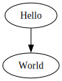
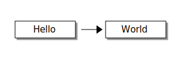

# quarto-kroki 

Render [Kroki](https://kroki.io/) diagrams on [Quarto](https://quarto.org/) documents.

This uses the _Kroki HTTP API_ via `curl` doing a _HTTP POST_ request.

## Installing

```bash
quarto add fermarsan/quarto-kroki
```

This will install the extension under the `_extensions` subdirectory. 

## Usage

Here is how you add the filter to a page (it can also be added to a `_quarto.yml` project file with
the same syntax):

```markdown
---
title: "My Document"
filters:
  - quarto-kroki
---
```

And then add the following markdown in your quarto file:

````markdown
```kroki-<diagram_kind>
    diagram code
```
````

for instance:

````markdown
```kroki-graphviz
digraph G { 
  Hello -> World 
}
```
````



or

````markdown
```kroki-ditaa
+---------+    +---------+
|  Hello  |--->|  World  |
+---------+    +---------+
```
````



Make sure you have `curl` is installed and available in your PATH.

## Examples

There are two source code minimal examples: 

- [test.qmd](test.qmd) _"HTML"_

- [test_pdf.qmd](test_pdf.qmd) _"pdf"_ 


## For PDF output

If the pdf output format is enabled, you can insert _Kroki_ diagrams via `inkscape`:

```markdown
---
title: "My Document"
filters:
  - quarto-kroki
format: pdf
---
```

In that case make sure you have `inkscape` installed and available in your PATH.
